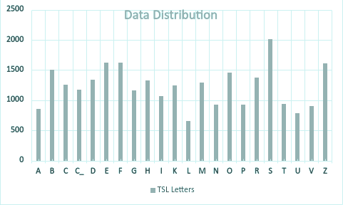
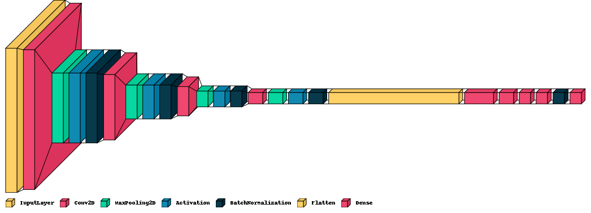

# Turkish Sign Language Alphabet Recognition using CNN

[](https://www.scitepress.org/PublishedPapers/2023/116287/116287.pdf)
[](https://www.dropbox.com/scl/fi/o8adlrw3jls6bz2sbpczr/TSL-DATASET.zip?rlkey=gpzkccmuzpndty0jgj03xpeuf&st=921j2s0r&dl=0)


Official implementation of the VISAPP 2023 paper:

**Turkish Sign Language Recognition Using CNN with New Alphabet Dataset**

**Authors:**
Tugce Temel, Revna Acar Vural

---

## Overview

Sign Language Recognition (SLR) aims to facilitate communication between the deaf community and people who do not know sign language. This repository presents a deep learning framework for recognizing **Turkish Sign Language (TSL) alphabet gestures** using a Convolutional Neural Network (CNN).

This work introduces the **first open-source Turkish Sign Language alphabet dataset**, collected from 30 volunteers under different conditions and used to train a custom CNN architecture for gesture classification.

Key contributions:

* First **open-source TSL alphabet dataset**
* Custom CNN architecture designed for efficient real-time inference
* High classification accuracy across multiple datasets

---

## Dataset

The dataset consists of static Turkish Sign Language alphabet gestures collected from volunteers using multiple cameras and environments.



**Dataset statistics**

| Property          | Value      |
| ----------------- | ---------- |
| Number of classes | 22 letters |
| Volunteers        | 30         |
| Images            | 27,064     |
| Image resolution  | 64 × 64    |
| Format            | RGB        |

Dynamic letters excluded from the dataset:

Ğ, İ, J, Ö, Ş, Ü, Y


[](https://www.dropbox.com/scl/fi/o8adlrw3jls6bz2sbpczr/TSL-DATASET.zip?rlkey=gpzkccmuzpndty0jgj03xpeuf&st=921j2s0r&dl=0)


---

## Model Architecture

The proposed CNN architecture contains several convolutional and normalization layers designed to extract hand gesture features efficiently.


Architecture summary:

| Layer Type                 | Count |
| -------------------------- | ----- |
| Convolution Layers         | 4     |
| Batch Normalization Layers | 5     |
| Pooling Layers             | 3     |
| Fully Connected Layers     | 5     |

Training configuration:

Optimizer: Adam
Loss Function: KL Divergence
Activation Function: ReLU
Input Resolution: 64×64×3

The architecture is designed to be lightweight while maintaining high recognition performance.

---

## Installation

Clone the repository:

```
git clone https://github.com/username/tsl-alphabet-cnn.git
cd tsl-alphabet-cnn
```

Install dependencies:

```
pip install -r requirements.txt
```

---

## Training

To train the CNN model:

```
python training/train.py
```

Training parameters can be modified inside:

```
training/config.yaml
```

---

## Evaluation

To evaluate the trained model:

```
python evaluation/test.py
```

Evaluation metrics include:

* Accuracy
* Precision
* Recall
* F1-score

---

## Real-Time Demo

You can run real-time gesture recognition using a webcam.

```
python realtime_demo/webcam_demo.py
```

The system captures hand gestures and predicts the corresponding Turkish Sign Language letter.

---

## Results

The proposed model achieved the following results:

| Dataset               | Accuracy |
| --------------------- | -------- |
| TSL Alphabet Dataset  | 99.9%    |
| ASL Dataset           | 99.7%    |
| MU HandImages Dataset | 99.35%   |

These results demonstrate the effectiveness of the proposed architecture for static hand gesture recognition.

---

## Repository Structure

```
tsl-alphabet-cnn
│
├── README.md
├── requirements.txt
├── LICENSE
├── CITATION.cff
│
├── dataset
│
├── models
│   └── cnn_model.py
│
├── training
│   └── train.py
│
├── evaluation
│   └── test.py
│
├── realtime_demo
│   └── webcam_demo.py
│
├── utils
│
├── figures
│
└── results
```

---

## Citation

If you use this work in your research, please cite:

```
@inproceedings{temel2023tsl,
  title={Turkish Sign Language Recognition Using CNN with New Alphabet Dataset},
  author={Temel, Tugce and Vural, Revna Acar},
  booktitle={International Joint Conference on Computer Vision, Imaging and Computer Graphics Theory and Applications (VISAPP)},
  year={2023}
}
```

---

## License

This project is released under the MIT License.

---

## Acknowledgements

This work was supported by TÜBİTAK 2209-A Research Support Program.
We thank all volunteers who participated in the dataset collection.
